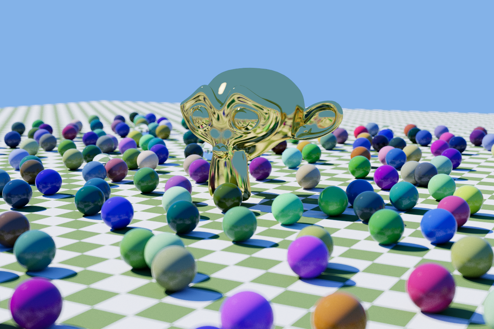
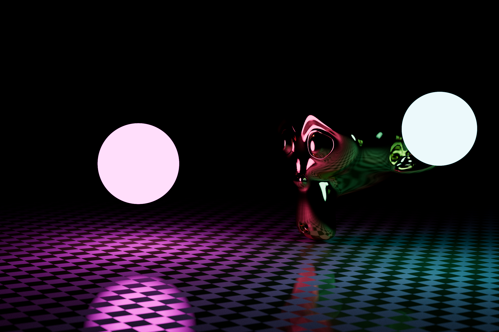
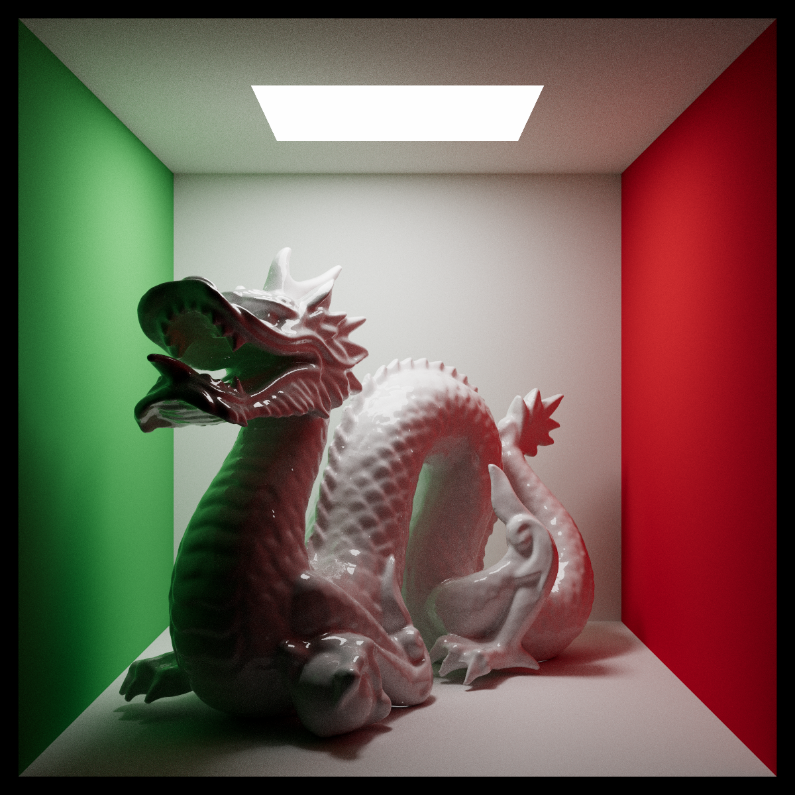

# rust_raytracer

A CPU path-tracing renderer written in Rust, largely following the [Ray Tracing in One Weekend](https://raytracing.github.io/) book series, with some additions of my own.

Everything is done "from scratch" as much as possible: no math libraries are used, and external dependencies are limited to fast RNG with the `rand`/`rand_pcg` crates and reading/writing of image files with the `image` crate.

## Sample renders

|                                         | Details                                                                                        |
| --------------------------------------- | ---------------------------------------------------------------------------------------------- |
|  | Default scene, Suzanne (~15.7k tris), sky + sun lights. 1200x800 @4000spp (10 threads), ~6m40s |
|  | `scenes/light_test`, Suzanne (~15.7k tris). 2400x1600 @1000spp (10 threads), ~20m              |
|  | `scenes/cornell_dragon`, Stanford dragon (~870k tris). 1200x1200 @1000spp (10 threads), ~41m   |

(Render times as measured on 11-core Apple M3 Pro)

## Building/running

Simply run `cargo run --release` in the project directory. Don't run a debug build even for testing, it'll be horribly slow. It should run on any platform, but isn't tested on anything other than macOS on arm64.

## Command line args

Usage: `rust_raytracer [<scene>] [<flags>]`

`<scene>` is one of a few default scene names or the path to a scene file (some sample scene files are included in `scenes/`). If no scene is specified, the default scene will be rendered.

`<flags>` is a space-separated list of flags and parameters. No parameters are required, but I recommend specifying at least the `-t` parameter as the renderer defaults to single-threaded. Default values for all parameters depend on the scene.

Flags follow a `-f=<value>` or `--flag=<value>` format. Many flags have a one-letter short variant.

The following flags can be used:

`-w`, `--width`: Render output width, in pixels.  
`-r`, `--aspect-ratio`: Aspect ratio, determines render height.  
`-f`, `--focal-length`: Camera focal length, in mm ([35mm equivalent](https://www.nikonians.org/reviews/fov-tables)).  
`-a`, `--aperture`: Lens aperture as an f-number. Controls depth blur.  
`-d`, `--focus-dist`: Focus distance. By default focus is at the point the camera is looking to.  
`-c`, `--camera-position`: Position of the camera as a point.  
`-l`, `--look-at`: Camera target point.  
`-t`, `--threads`: Number of threads to use, defaults to 1.  
`-s`, `--samples`: Samples per pixel, upper bound. Defaults to 250.  
`--max-depth`: Max recursion depth when bouncing rays around. Defaults to 20.  
`--light-bias`: Light bias amount for diffuse scattering. 0 is completely unbiased (true diffuse), 1 sends all rays towards light sources (no GI). Defaults to 0.25.

### Note on samples per pixel

Because of the pixel stratifying used when sampling, the number of samples per _thread_ must be a square of an integer (1, 4, 9, 25, 36, ...). This means the renderer can't always use the number of samples specified with `-s`, which is instead interpreted as the _maximum_ number of samples per pixel to use.

For example: rendering with 10 threads at 100spp, each thread should sample 10 times. The closest square below 10 is 9, so each thread will take 9 samples per pixel (in a 3x3 pattern) for a total of 90spp.

The program will output actual samples used before starting the render.

## What it does

- Renders path-traced images with global illumination
- Several basic materials (lambertian diffuse, metals, dielectrics)
- Simple glossy PBR material
- Simple procedural textures (noise, interpolation, etc)
- Image textures for albedo and roughness
- Normal maps (very rough implementation)
- Basic volumes (constant density, convex boundaries only)
- Scene optimization using bounding volume hierarchies (BVH)
- Mesh loading in Wavefront OBJ format (tested with large meshes of about 870k tris)
- Mesh optimization using octrees
- Light source-biased scattering using ray-space scatter PDFs
- Depth-of-field effects
- Very basic tonemapping
- Scene loading with a simple custom DSL
- Multi-threaded rendering

## What it doesn't do

- More complex volumes
- Proper parametric materials
- Subsurface scattering
- Displacement mapping
- Many more things

## Code structure

Hopefully the module structure should be pretty clear as to what everything does. `main.rs` does little more than load a scene, call the render function and save a file. Most of the rendering core is in the `Camera` struct (`src/camera.rs`). Ray intersections are handled by each object type implementing the `Hit` trait (in `src/objects`) and scattering is handled by each material (in `src/material`).

The code is written with performance in mind, but not super-optimized; it can probably be made to run a lot faster. As a learning project, clarity comes first: you should be able to read the code and understand how a path tracer works.
